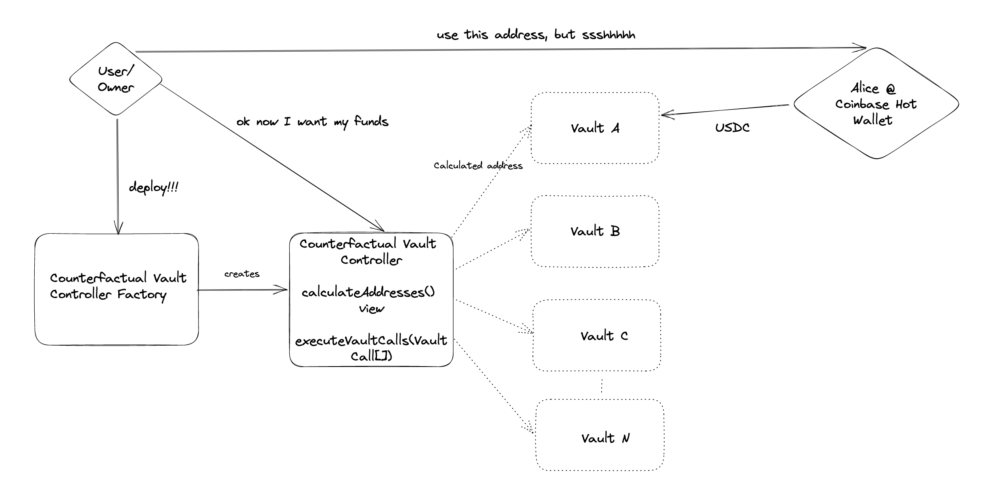

# Counterfactual Vaults

Contract suite to faciliate counterfactual vault creation and management.

## Lifecycle:

A CounterfactualVaultController is deployed for an EOA (`0xA`) funded with ETH.

ERC20/721 and Ether can be sent to any counterfactual addresses associated with this contract. These can be calculated using the function `computeAddress(vaultId)` where `vaultId` is a nonce of choice. This address is communicated out of bands to a counterparty.

Later, `0xA` can _sweep_ the funds received at these counterfactual addresses to a destination of their choice.

For example:

1. `0xA` calculates counterfactual address `0xA1` with `vaultId` = 1
1. `0xA1` sends this address to counter party B (address `0xB`)
1. `0xB` sends 100 USDC to `0xA1`
1. `0xA` _sweeps_ `0xA1` to a destination address `0xZ` by calling `executeVaultCalls(vaultId = 1, to = 0xZ, value = =0 data = [erc20 = usdc address, amount = 100])`

 ### Privacy
This pattern does seem to introduce some level of ephemeral unlinkability similar to that gained in a16z's sneaky auction https://a16zcrypto.com/hidden-in-plain-sight-a-sneaky-solidity-implementation-of-a-sealed-bid-auction/

If the vaultId's are random enough, then it is hard to index sufficiently so that you can identify a transaction sent to a related CounterfactualVaultController address.

### Under the hood

A minimal proxy factory is used to create (CREATE2) a CounterfactualWallet which is then swept for ERC20, ERC721 or Ether to a target address specifed.
The contract is then destroyed within the same transaction.

An ERC20 transfer which usually costs 50k gas now costs 130k (:()

## About

Inspired by PoolTogether's Lootbox (https://github.com/pooltogether/loot-box) and a16z's sneaky auction (https://a16zcrypto.com/hidden-in-plain-sight-a-sneaky-solidity-implementation-of-a-sealed-bid-auction/).

## Development

This project uses [Foundry](https://getfoundry.sh). See the [book](https://book.getfoundry.sh/getting-started/installation.html) for instructions on how to install and use Foundry.

### Testing
Run `forge test`
